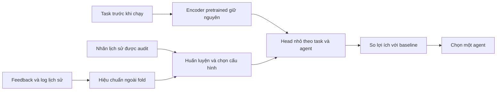

# DART: hướng dùng neural router để học lợi ích quyết định dưới feedback sai

**Ngày nghiên cứu: 05/10/2026. Trạng thái: đề xuất nghiên cứu, chưa triển khai/chưa có kết quả cho kiến trúc mới.**

Tài liệu này dựa trên kết quả forensic đã chạy và đối chiếu nguồn sơ cấp, gồm các paper mới đến cuối tháng 9/2026. Nó thay đổi thứ tự ưu tiên: kiểm tra khả năng học được sự bổ trợ, sau đó xây learner nhỏ theo task, rồi mới thêm active audit và verifier lớn. Không coi một phương pháp mới là đã thắng khi chưa có thực nghiệm.

## 1. Quyết định đề xuất

**Có áp dụng neural network và Transformer. Phương án ưu tiên là một Transformer encoder đã pretrained, giữ nguyên trọng số, kết hợp bộ chọn agent nhỏ học trực tiếp lợi thế tương đối; dùng nhãn kiểm chứng để sửa ảnh hưởng của lịch sử sai và lựa chọn các cặp lịch sử cần kiểm chứng.**

Không bắt đầu bằng fine-tune toàn bộ Transformer, GNN lớn, RL hoặc chạy lại toàn bộ judge. Lý do là dữ liệu hiện tại ít và lỗi đã đo nằm cả ở supervision, cách dùng nhãn, và mục tiêu quyết định. Kiến trúc lớn hơn không tự tạo thêm thông tin về agent nào sẽ cứu một task.

Ba quyết định cụ thể:

1. **Giữ tên DART, thay learner cốt lõi** nếu các gate bên dưới đạt: từ chọn trong bank nhỏ bằng các ước lượng nhiễu sang học tương tác task–agent với regularization mạnh.
2. **HistRepEval tiếp tục là hạ tầng đánh giá** feedback sai và các failure modes. Đích mong muốn là benchmark/evidence + phương pháp; hiện chưa đủ bằng chứng cho claim phương pháp vượt trội.
3. **Không chọn kiến trúc dựa vào độ mới của tên gọi.** Chọn theo lợi ích gia tăng so control mạnh trên cùng quyền truy cập và ngân sách.

## 2. Những ràng buộc mà phương pháp phải giải quyết

Từ [forensic đã chạy](dart_root_causes_and_next_steps_2026-10-05.md):

- 168 task, 56 generator, 14 agent. 2.352 outcome không phải 2.352 instruction độc lập; 14.400 lượt replay không làm tăng kích thước dataset.
- Ở budget 10%, năm outer fold có **172, 180, 189, 197 hoặc 201 nhãn gold** trong mỗi lượt học; outer-train có 123–144 task. Không được dùng toàn bộ 2.352 gold để train phương pháp ở budget này.
- DARTContrast/judge 63,90/168; gộp đúng nhãn đã audit cho CSGlobal 68,90; UniformAuditGlobal 69,70; PairedGlobal 71,95. Cách dùng nhãn cần được sửa trước khi kỳ vọng thắng nhờ mạng lớn.
- Continuous calibration cải thiện Brier nhưng chưa tăng routing. Mục tiêu học không được chỉ là dự đoán xác suất đẹp.
- 391 false positive được judge chấm ≥90% dù log đầy đủ. Chọn thêm pseudo-label dựa trên độ tự tin thô rất dễ nhân rộng lỗi.
- Oracle 134/168 và retrospective best single 82/168 chứng minh có kết quả bổ trợ, **không chứng minh có thể nhận ra chúng từ input trước khi chạy**.

### Điều kiện nền tảng để thắng

Gọi X là toàn bộ thông tin thực sự có trước routing và Y_a là kết quả của agent a. Trần phù hợp với routing là:

`E[max_a E(Y_a | X)]`,

khác với oracle nhìn outcome `E[max_a Y_a]`.

Nếu cùng một agent luôn tốt nhất theo kỳ vọng có điều kiện trên X, mọi router chỉ nhìn X không thể vượt agent đó về expected accuracy. Đây là suy luận từ định nghĩa kỳ vọng có điều kiện, không phải một phát hiện mới của DART. Vì vậy “thắng triệt để trong mọi trường hợp” không phải mục tiêu khả thi; mục tiêu là thắng trong các điều kiện đã định nghĩa và chứng minh được lợi ích đó.

## 3. Literature làm thay đổi đề xuất như thế nào?

### Các công trình gần nhất

| Công trình / nguồn sơ cấp | Nội dung liên quan | Hệ quả cho DART |
|---|---|---|
| [RouteLLM, ICLR 2025](https://arxiv.org/html/2406.18665v4) | So router matrix factorization, BERT, causal LM và similarity. Kết quả phụ thuộc dữ liệu phù hợp miền; mạng lớn không luôn tốt nhất. | MF/linear là control bắt buộc; chuyển từ TF-IDF sang Transformer chưa đủ novelty. |
| [GraphRouter, ICLR 2025](https://arxiv.org/html/2410.03834v2) | Graph task–query–model và dự đoán quan hệ hiệu quả/cost. | GNN áp dụng được, nhưng cần đủ edge quan sát và protocol inductive không rò outcome test. |
| [IRT-Router, ACL 2025](https://aclanthology.org/2025.acl-long.761/) | Mô hình hóa năng lực đa chiều của model và đặc trưng query, có bản neural. | Low-rank task–agent interaction là lựa chọn hợp lý để thử; không thể claim ý tưởng năng lực/độ khó là mới. |
| [Causal LLM Routing](https://arxiv.org/html/2505.16037v2) | Học policy theo regret từ utility ước lượng bằng correction cho feedback quan sát không đầy đủ. | “DR + neural + regret” đã có. Cần phân biệt selection bias với nhãn feedback sai. |
| [SemiRouter, EACL 2026](https://aclanthology.org/2026.eacl-long.228/) | Backbone học từ anchor model có nhiều dữ liệu, rồi adapter/contrastive learning cho model ít nhãn. | Không được cấp miễn phí một tập anchor gold dày cho DART; phải tính budget/pretraining cho tất cả phương pháp. |
| [EquiRouter, preprint 02/2026](https://arxiv.org/html/2602.03478v1) | Biểu diễn phụ thuộc query–model và loss ranking để giảm lệch giữa dự báo score và quyết định. | Ranking theo model là baseline gần, không phải điểm mới riêng. |
| [LLMRouterBench, bản 01/2026](https://arxiv.org/html/2601.07206v1) | Đánh giá thống nhất phát hiện nhiều router khó thắng best-single; thay backbone embedding trong các ablation cho ảnh hưởng hạn chế. | Không suy ra “encoder mạnh hơn sẽ cứu được DART”. Kết quả của benchmark không chứng minh encoder vô dụng trên AppWorld. |
| [SaveRouter, preprint 29/09/2026](https://arxiv.org/html/2609.37402v1) | Sparse acquisition, ước lượng năng lực theo nhóm và residual theo query; tính cả chi phí thu supervision. | Rất gần đề xuất hierarchical + active audit. Phải là đối chứng ưu tiên, và cần luận điểm khác rõ về **độ tin cậy nhãn**. |
| [CABS, preprint 07/2026](https://arxiv.org/html/2607.09015v1) | Học với surrogate reward, tách nhánh true reward và surrogate để xử lý misspecification. | Robustness với surrogate đã có; khác biệt quyền quan sát true reward phải được ghi rõ. |
| [RouteGuard, preprint 08/2026](https://arxiv.org/html/2608.07583v1) | Phân biệt complementarity/AUC với gain có thể chứng nhận; chú trọng đơn vị lấy mẫu. | “Chỉ switch khi có bằng chứng”, “oracle headroom không đủ” không thể claim là novelty chính. |
| [Signed Rescue Routing, preprint 09/2026](https://arxiv.org/html/2609.07786v1) | Dự báo rescue và harm cho cascade hai model. Bản đọc có các con số thực nghiệm ghi `TBD`. | Ghi nhận prior art về objective; **không dùng làm bằng chứng thực nghiệm đã xác nhận**. Setting nhìn output model nhỏ khác pre-routing của mình. |
| [COMED, preprint 22/09/2026](https://arxiv.org/abs/2609.26913) | Điều khiển collaboration sau khi có anchor response, có phân tích rescue/harm. | Là hướng khác nếu chuyển sang hậu kiểm; phải tính thêm calls và ảnh hưởng trạng thái, không gộp vào routing một-call. |

Nguồn nền tảng: [PPI++](https://arxiv.org/html/2311.01453v2), [Cross-PPI](https://arxiv.org/html/2309.16598v2), [Active Statistical Inference](https://proceedings.mlr.press/v235/zrnic24a.html). Những công cụ correction/cross-fitting/active annotation này phải được ghi nhận là thành phần kế thừa.

Tìm thêm thấy [Corrected Preference Routing](https://openreview.net/pdf?id=Lpsknvbvom) và [BayesRouter](https://openreview.net/attachment?id=K3xNTJOM1j&name=pdf), nhưng forum OpenReview bị browser verification; nội dung được lập chỉ mục ghi anonymous submission/under review. Đưa vào danh sách rà soát novelty; chưa xác nhận acceptance hay toàn bộ reproducibility, không dùng các claim thắng của chúng làm sự thật đã kiểm chứng.

### Đánh giá độ mới một cách trung thực

“Transformer + low-rank + ranking + active learning + fallback” là tập hợp nhiều kỹ thuật đã biết. **Hiện chưa xác nhận tổ hợp đề xuất đủ novelty cho bài A/A*.** Khoảng trống cần kiểm tra và phát triển là:

> Học quyết định tốt từ lịch sử có outcome claim sai theo agent/task, khi chỉ được mua ít nhãn kiểm chứng; chọn những cặp cần audit để giảm sai số quyết định, và giữ hiệu quả khi reliability thay đổi.

Để thành đóng góp phương pháp, cần một thiết kế acquisition/estimation cụ thể, phân tích hoặc thí nghiệm cho thấy lợi ích vượt cách ghép baseline hiện có. Nếu không vượt SaveRouter/CausalRouter/SemiRouter/CABS thích nghi đúng setting, không gọi đây là SOTA.

## 4. Kiến trúc ưu tiên: DART học tương tác task–agent

### 4.1. Transformer làm encoder, learner nhỏ học quyết định

Luồng thông tin:

Bắt đầu với một encoder sentence Transformer nhỏ, cố định và dùng chung cho baseline; chỉ thử encoder thứ hai trong ablation giới hạn. Dùng embedding của instruction, cộng feature yêu cầu công việc nhìn thấy trước routing: đếm/lọc, thao tác thời gian, nhiều bước, cập nhật trạng thái, so khớp tập hợp. Không dùng tên generator, gold required-app list, đáp án, private_data hoặc future trajectory của task test.

Họ score nhỏ được đề xuất:

`s_a(x) = b_a + u_a^T W e(x)`.

- `b_a`: năng lực toàn cục, shrink về control ổn định.
- `e(x)`: embedding giảm chiều từ train inputs, không dùng test gold.
- `W e(x)` và `u_a`: tương tác task–agent hạng thấp.
- Khóa rank nhỏ như 2 hoặc 4 trong shortlist trước chạy; regularization chọn bằng inner validation với đúng nhãn đã được mua.

Ví dụ với embedding rút xuống 16 chiều và rank 2: 32 trọng số W + 28 trọng số agent + 14 bias = **74 tham số**, chưa tính component bổ sung. Đây là minh họa kích thước, không chứng minh 74 tham số đủ học tốt từ ~190 nhãn. Một MLP nhỏ là đối chứng kiến trúc, không tự động làm default.

Pool gồm cả model và scaffold khác nhau. Có thể kiểm tra factor theo model/scaffold để chia sẻ thông tin, nhưng phải giữ interaction và regularization; không giả định tác dụng model với scaffold luôn cộng tuyến tính.

**Tránh lặp lại giới hạn ECRT:** nếu chỉ học `s_a(x)=b_a-d(x)` với cùng difficulty cho mọi agent, thứ hạng agent không đổi theo x. Mạng có vẻ hiểu task nhưng vẫn chọn cùng một người. Tương tác task–agent phải thực sự làm thay đổi thứ hạng khi dữ liệu ủng hộ.

### 4.2. Học lợi thế so baseline, không chỉ nhãn “thành công”

Với baseline b được chọn từ train audits, định nghĩa:

`Δ_a(x) = E[Y_a − Y_b | x]`.

Trong dữ liệu cặp cùng task:

- Rescue: a đúng, b sai → +1.
- Harm: a sai, b đúng → −1.
- Cùng đúng hoặc cùng sai → 0.

Học gain hoặc phân phối ba trường hợp này. Nếu dùng hai head rescue/harm, gain là hiệu hai xác suất. **Không chỉ học winner trên những cặp khác kết quả rồi bỏ tần suất khác kết quả:** xác suất thắng có điều kiện trên discordance không đủ biểu diễn độ lớn gain để quyết định khi nào switch.

Đối chứng cùng head phải gồm loss dự báo outcome, pairwise/ranking và regret. Nếu cùng nhãn correction mà các loss tương đương, đóng góp nằm ở supervision/audit, không tự gán cho neural architecture.

### 4.3. Log/judge lịch sử hỗ trợ huấn luyện, không trở thành feature tương lai miễn phí

Teacher có thể đọc trajectory **lịch sử** để ước lượng m(x,a,log), nhưng student dùng trước routing chỉ đọc thông tin khả dụng lúc đó. Nhãn gold đã audit dùng để kiểm tra và hiệu chuẩn teacher ngoài fold; không dùng confidence thô làm tiêu chuẩn pseudo-label đáng tin.

Cần ba nhánh tách biệt:

1. Gold-only learner, không feedback.
2. Learner dùng feedback thô/hiệu chuẩn theo cách phổ biến.
3. Learner dùng feedback có correction từ audit.

Nếu nhánh 3 không hơn 1 ở cùng tổng cost, contribution về imperfect history chưa được chứng minh. Distillation không tạo ground truth; teacher sai hệ thống thì student có thể học lại chính sai đó.

## 5. Đổi cách mua nhãn: so các cặp có liên quan đến quyết định

### Vấn đề với audit đủ 14 agent trên một task

Budget gần 190 nhãn chỉ đủ khoảng 13 task được audit cả 14 agent. Ta có nhiều so sánh trong cùng task nhưng phủ ít nội dung. Cặp baseline–challenger trên nhiều task có thể phủ rộng hơn; ví dụ 190 nhãn có trần 95 cặp task nếu mỗi cặp cần hai nhãn mới, **chưa trừ** ngân sách warm-up/validation. Các cặp dùng chung outcome không phải quan sát độc lập.

### Acquisition đề xuất

- Giai đoạn đầu: randomized pair audits theo thiết kế cố định, đủ coverage agent/task; học gain neural mà chưa thêm thích nghi để cô lập tác dụng learner.
- Sau khi learner có ích: ưu tiên những cặp mà biết gold có khả năng đổi lựa chọn, có ảnh hưởng đến nhiều task tương tự, và đang thiếu bằng chứng đáng tin.
- Không dùng entropy judge làm tiêu chí duy nhất: chính các lỗi tự tin có thể bị bỏ qua.
- Giữ xác suất khám phá dương và ghi xác suất thực; cost cho một cặp là số nhãn chưa biết cần mua, không mặc định một cặp = một nhãn.
- So acquisition này với uniform cell, uniform pair, full-row paired và acquisition gần của SaveRouter. Tách “học tốt hơn” khỏi “lấy nhãn tốt hơn”.

Giá trị thông tin của một audit có thể được xấp xỉ bằng mức giảm expected routing regret trên tập instruction train chưa gán nhãn, thay vì giảm Brier toàn ma trận. Đây là heuristic cần định nghĩa và thử nghiệm; không gọi entropy/disagreement là expected value of information chính xác.

### Chi tiết thống kê không được bỏ qua

Nếu học trực tiếp label cặp, xác suất quan sát đủ hai nhãn là `q_ab=P(A_a=1,A_b=1)`. Với paired/pivotal sampling, nói chung **q_ab không bằng q_a q_b**. Phải dùng joint inclusion thật hoặc chọn design đơn giản có thể tính được.

Nếu chỉ hiệu chỉnh chênh lệch của hai mean, marginal q có thể đủ cho điểm ước lượng; variance và event rescue/harm vẫn cần xét phụ thuộc. Không tráo hai trường hợp này.

Adaptive acquisition phụ thuộc nhãn cũ làm cross-fitting ngược trở nên khó: xác suất có điều kiện ở mỗi lượt không mặc nhiên là inclusion probability cuối cùng. Trước hết dùng design độc lập để kiểm tra learner; phần thích nghi phải có estimator/variance phù hợp trước khi tuyên bố bảo đảm.

## 6. Dùng correction để học policy, nhưng không coi nó là phép màu

Một baseline nghiên cứu quan trọng là utility có correction:

`ỹ_ia = m_ia + A_ia/q_ia × (Y_ia − m_ia)`

`Û(π) = mean_i sum_a π(a|x_i) × ỹ_ia`.

Với proxy và policy cố định phù hợp thiết kế audit, correction giải quyết bias do chỉ quan sát một phần nhãn. Nhưng:

- Learner tối đa hóa cùng một ước lượng trên nhiều policy vẫn có thể overfit.
- Cross-fit proxy không biến policy được huấn luyện bằng tất cả nhãn thành policy độc lập với nhãn đánh giá.
- ỹ có thể ngoài [0,1]; không đưa nó vào binary cross-entropy như một xác suất hợp lệ.
- Correction không biến judge sai thành gold; Y ở phần correction phải là nhãn kiểm chứng.
- Nhãn validation/calibration lấy từ train phải tính vào tổng audit budget; không cấp miễn phí cho DART hay baseline.

Cần head nhỏ, shrinkage, objective utility/ranking phù hợp, giới hạn shortlist và honest validation theo generator. [Causal LLM Routing](https://arxiv.org/html/2505.16037v2) là đối chứng trực tiếp cho hướng objective này; [Cross-PPI](https://arxiv.org/html/2309.16598v2) cung cấp động cơ dùng nhãn hiệu quả nhưng không cấp sẵn chứng minh cho adaptive policy learning của mình.

## 7. Gate và chứng minh: fallback giúp hạn chế hại, không tạo gain

Ở inference, so gain dự đoán với baseline. Gate có thể dùng uncertainty hoặc threshold được khóa trên validation. Chỉ gọi là heuristic cho đến khi có bằng chứng coverage/risk phù hợp phân phối và sampling.

Deep ensemble, Bayesian head hoặc conformal không tự bảo đảm không thua khi distribution shift. Fallback luôn baseline có thể tránh switch sai nhưng cũng cho gain bằng 0. Muốn claim thắng cần đồng thời có switch, rescue nhiều hơn harm, và lợi ích ngoài mẫu vượt noise.

Không tuyên bố “lần đầu chứng nhận lợi ích routing”: [RouteGuard](https://arxiv.org/html/2608.07583v1) đã nghiên cứu rất gần. Novelty nếu có phải nằm trong cách **thu nhận và sử dụng nhãn kiểm chứng từ lịch sử sai**, hoặc một kết quả mới cho setting đó.

## 8. Transformer, GNN, RL và kỹ thuật khác: chọn gì trước?

| Kỹ thuật | Vai trò có thể hữu ích | Quyết định hiện tại |
|---|---|---|
| Frozen Transformer + low-rank head | Hiểu task và học tương tác ít tham số | **Ưu tiên 1** |
| Frozen Transformer + MLP nhỏ | Kiểm tra tương tác phi tuyến có giúp hơn low-rank không | Shortlist đối chứng |
| Neural IRT / MF | Chia sẻ cấu trúc năng lực giữa agent/task | Baseline và nền kiến trúc |
| Contrastive/ranking learning | Tập trung vào thứ tự agent và cặp có ý nghĩa | Thử sau khi khóa supervision; phải so EquiRouter/SemiRouter |
| GNN task–agent | Chia sẻ thông tin qua quan hệ quan sát | Chỉ ưu tiên khi có archive nhiều task/edge; mask outcome test nghiêm ngặt |
| LoRA/full Transformer fine-tuning | Điều chỉnh representation đặc thù agentic tasks | Để sau khi có dữ liệu khác miền đủ lớn và learning curve ủng hộ |
| RL/DPO | Tối ưu policy từ utility/preference | Chưa ưu tiên: reward sai và dữ liệu ít vẫn là điểm nghẽn; cần thắng loss đơn giản trước |
| Teacher–student | Dùng log quá khứ để học router rẻ trước thực thi | Nhánh bổ sung có kiểm chứng; không lấy teacher làm ground truth |
| Checklist verifier + thinking | Nhận ra thiếu hậu điều kiện hoặc lỗi ngữ nghĩa | Pilot riêng, cùng input và tổng cost; chỉ scale nếu giúp decision value |
| Cascade/probe trước quyết định cuối | Tạo thêm tín hiệu khi instruction không đủ | Track khác, phải tính các call đã chạy; có trạng thái thì cần snapshot/read-only hoặc môi trường riêng |

## 9. Kế hoạch thực nghiệm theo thứ tự và điều kiện dừng

### P0 — kiểm tra liệu lợi thế theo task có học được không

Trên **public development normal đã xem**, chạy diagnostic với full gold outer-train để so ba model đã khóa: linear/ridge, low-rank và MLP nhỏ với cùng frozen features; đánh giá theo generator chưa xuất hiện trong train. Tên rõ là **full-label diagnostic**, không xếp vào bảng thắng audit 10%. T không vào training/hyperparameter selection; các fold đã dùng nhiều lần vẫn là development.

Mục đích: kiểm tra họ feature/learner có tín hiệu vượt full-label train-global hay không khi nhãn tạm không còn là nút thắt. Nếu không có gain, chưa tăng complexity hoặc active audit. Thử một ablation feature có cơ sở hoặc thêm dữ liệu; nếu vẫn không có tín hiệu, cân nhắc probe/cascade có tính cost. Thất bại của một probe không chứng minh mọi router đều bất khả thi.

### P1 — learner với đúng ngân sách và không thay acquisition

So cùng audit mask: full-budget global, shrinkage linear/low-rank, MLP nhỏ, objective outcome/ranking/regret, có/không calibrated history. Ngân sách 10% chính; 5% và 20% phụ. Tuning dùng trong budget; outer T chỉ đo. Không grid hàng trăm cấu hình để tìm một winner trên 168 task.

Gate nghiên cứu: tín hiệu cải thiện nhất quán với control mạnh, rescue/harm hợp lý, không chỉ Brier tốt hoặc thắng vài seed. Chưa gọi exploratory CI là bằng chứng xác nhận cuối.

### P2 — acquisition cặp và kiểm tra cơ chế

Chỉ sau P1, thêm pair acquisition cho cùng learner. Ablation một thành phần: uniform cell → uniform pair → active pair; cùng tổng nhãn, cùng encoder và training. Báo coverage task/generator, coverage agent, q/joint-q, variance và cost nhãn.

Gate: learner giống nhau mà acquisition cải thiện downstream utility. Nếu không, giữ uniform; không ép active audit thành đóng góp khi dữ liệu không ủng hộ.

### P3 — mạnh hóa verifier nếu lợi ích kỳ vọng xứng đáng

Pilot cố định theo hash trên development, so direct/thinking/checklist, không chọn chỉ những lỗi đã biết. Gold-blind prompts. Đo FP tự tin, calibration, task-completion evidence, router gain và token/latency. Không mở rộng chỉ vì judge giải thích dài hơn hoặc Brier đẹp hơn.

### P4 — benchmark lớn, đối chứng gần và xác nhận

Thêm dataset routing có archive đủ lớn hoặc agentic benchmark có evaluator độc lập, kiểm tra licence/version và task overlap trước. Không trộn kết quả model chạy thời kỳ khác rồi claim cùng compute. [LLMRouterBench](https://arxiv.org/html/2601.07206v1) là ứng viên để kiểm tra, không mặc định mọi record đều có cùng định dạng/cost hoặc độc lập với MMLU sealed.

Đối chứng tối thiểu:

1. UniformAuditGlobal và PairedGlobal.
2. Neural gold-only cùng backbone/head/budget.
3. RouteLLM-MF hoặc IRT phù hợp multi-agent.
4. SaveRouter và CausalRouter/RM-Softmax, với adaptation được công bố rõ.
5. EquiRouter/SemiRouter khi có đủ supervision đúng setting; CABS khi đánh giá setting online phù hợp.
6. DART cũ và các ablation loại từng đóng góp.

Không cho baseline đọc nhãn chưa audit; cũng không âm thầm thay thuật toán paper rồi giữ nguyên tên như tái lập chính xác. Cần cả so sánh đúng setting gốc khi phù hợp và phiên bản thích nghi cùng quyền truy cập.

Khóa endpoint accuracy trước khi đổi sang cost–quality. Đếm mọi pretrained labeled data, annotation, verifier calls và solver cost. Nếu chuyển sang claim tiết kiệm chi phí, phải có cost đo được và quality constraint khóa trước; không đổi mục tiêu sau khi accuracy thua.

## 10. Kích thước dữ liệu và tiêu chí cho bài mạnh

168 task/56 generator thích hợp cho phát hiện cơ chế, khó đủ cho nhiều neural variants và kết luận gain nhỏ. Lặp 20 seed audit không tạo thêm 20 bộ dữ liệu độc lập. Cần power analysis theo chênh lệch paired và đơn vị generator trước khi quyết định kích thước xác nhận.

Minh họa kế hoạch, **không phải ước lượng từ dữ liệu hiện tại**: với chênh lệch mục tiêu 3 điểm %, tỷ lệ hai policy khác correctness khoảng 20%, giả định task iid và xấp xỉ normal, cỡ mẫu để có power 80% với kiểm định hai phía 5% vào khoảng 1.700–1.800 task. Cluster dependence có thể làm cần nhiều hơn. Con số cuối phải dùng variance/cluster size của pilot độc lập, không lấy 168 × số seed làm N.

Một claim đủ mạnh cần:

- Gain so baseline đã khóa trên test mới, CI phù hợp cluster và số phép thử.
- Cùng ngân sách gold và cùng quyền truy cập; ghi rõ tổng cost.
- Thành phần mới có incremental gain qua ablation; không chỉ do encoder mạnh hơn hoặc thêm data.
- Ít nhất hai bối cảnh đủ khác nhau, hoặc một setting thực tiễn sâu với đánh giá quy mô/shift mạnh.
- Thử reliability shift, lỗi có hệ thống theo agent/task và severe confident false positives; không chỉ random label flips.
- Novelty được phân biệt với sparse routing, DR learning, rescue/harm và certification đã có.

## 11. Kết luận để ra quyết định

**Hướng đáng đầu tư nhất hiện tại:** frozen Transformer + learner low-rank theo task–agent, học lợi ích tương đối từ gold đã audit; sau khi learner có tín hiệu mới phát triển acquisition cặp và correction cho feedback sai. Đây là một giả thuyết nghiên cứu cụ thể, có cơ chế và có thí nghiệm bác bỏ được.

**Việc nên làm đầu tiên khi triển khai:** P0 và P1. Chúng trả lời liệu representation/learner mới có thể khai thác sự bổ trợ thật, và liệu lợi ích có giữ được với 172–201 nhãn hay không. Nếu cả hai không đạt, huấn luyện Transformer lớn hoặc chạy full thinking sẽ là quyết định thiếu bằng chứng.

Mục tiêu vẫn là DART có lợi ích thực tế và HistRepEval cung cấp đánh giá đáng tin. Chưa có bảo đảm thắng mọi đối chứng hoặc được nhận hội nghị A/A*. Giá trị của kế hoạch này là tránh sửa sai tầng: phân biệt thiếu thông tin, thiếu nhãn, nhãn sai, estimator nhiễu và objective lệch trước khi tăng tài nguyên.

**Nguồn nội bộ:** `results/dart_audit_judge_v1/audit_trace_private.jsonl` (budget/fold counts), `results/dart_same_audit_v2/analysis.json`, [bảng forensic đầy đủ](dart_same_audit_tables_2026-10-05.md). Lượt nghiên cứu này không chạy model/learner mới, không mở holdout và không thay code thực nghiệm.
